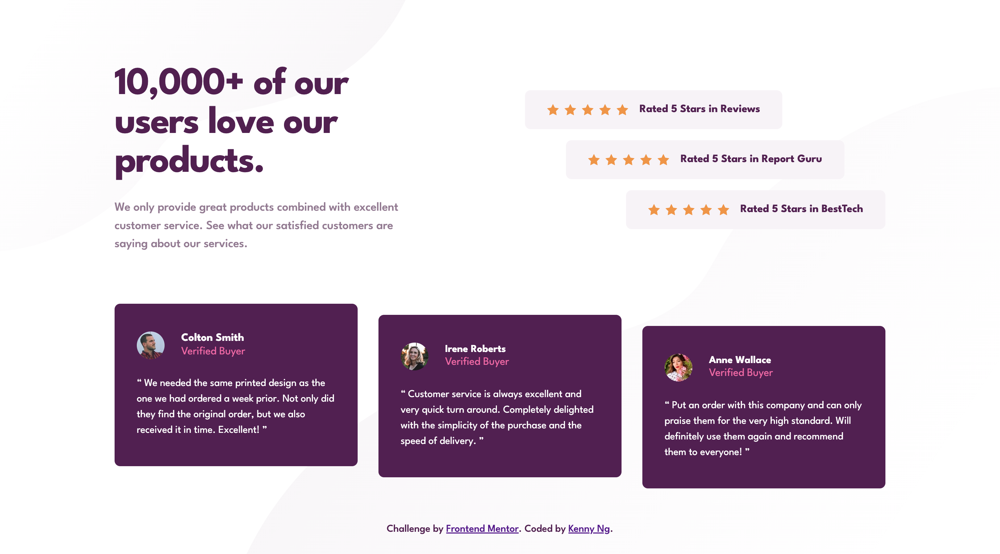
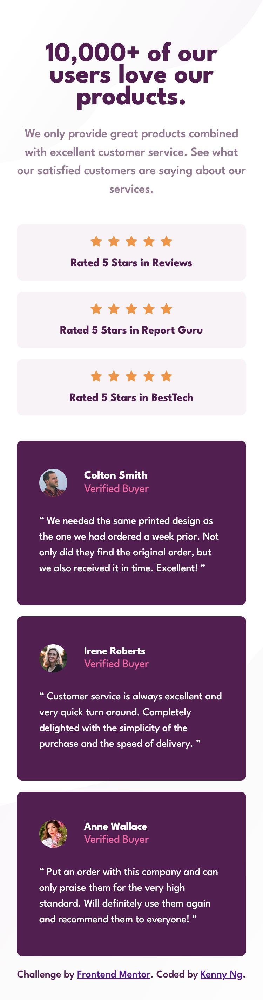

# Frontend Mentor - Social proof section solution

This is a solution to the [Social proof section challenge on Frontend Mentor](https://www.frontendmentor.io/challenges/social-proof-section-6e0qTv_bA). Frontend Mentor challenges help you improve your coding skills by building realistic projects.

## Table of contents

- [Overview](#overview)
  - [The challenge](#the-challenge)
  - [Screenshot](#screenshot)
  - [Links](#links)
- [My process](#my-process)
  - [Built with](#built-with)
  - [What I learned](#what-i-learned)
  - [Useful resources](#useful-resources)
- [Author](#author)

## Overview

### The challenge

Users should be able to:

- View the optimal layout for the section depending on their device's screen size

### Screenshot

<p>Desktop version</p>

<p>Mobile version</p>


### Links

- Solution URL: [https://www.frontendmentor.io/solutions/responsive-social-proof-section-using-css-grid-and-flexbox-sZ4WbMkDBh](https://www.frontendmentor.io/solutions/responsive-social-proof-section-using-css-grid-and-flexbox-sZ4WbMkDBh)
- Live Site URL: [https://kennylun123.github.io/fm-social-proof-section/](https://kennylun123.github.io/fm-social-proof-section/)

## My process

### Built with

- Semantic HTML5 markup
- CSS custom properties
- Flexbox
- CSS Grid
- Mobile-first workflow
- CUBE CSS


### What I learned

- CUBE methodology
- Reinforced learning on grid items' positioning

```css
.ratings > div:nth-of-type(1) {
  align-self: start;
}

.ratings > div:nth-of-type(2) {
  align-self: center;
}

.ratings > div:nth-of-type(3) {
  align-self: end;
}

.testimonial > article:nth-of-type(1) {
  margin-block: 0 2rem;
}

.testimonial > article:nth-of-type(2) {
  margin-block: 1rem;
}

.testimonial > article:nth-of-type(3) {
  margin-block: 2rem 0;
}
```

### Useful resources

- [CUBE CSS blog by Andy bell](https://andy-bell.co.uk/cube-css/)

## Author

- Website - [Kenny Ng](https://www.github.com/kennylun123)
- Frontend Mentor - [@kennylun123](https://www.frontendmentor.io/profile/kennylun123)
